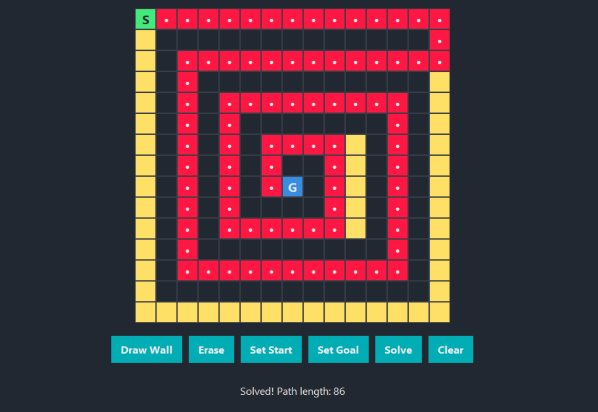

# 🧠 Maze Solver AI (A*) — Interactive & Modern Python App

> **Short Description:**
> 
> A visually stunning, interactive Python app to build, edit, and solve mazes using the A* algorithm. Features a modern GUI, live animation, and instant feedback—perfect for learning, teaching, or just having fun with AI pathfinding!



---

## 🚀 Features

- **Modern GUI**: Beautiful, dark-themed Tkinter interface with smooth controls and live status bar.
- **Interactive Maze Builder**: Draw walls, erase, set start/goal with a click. No special mouse buttons needed!
- **Live Animation**: Watch the A* algorithm search and find the optimal path, step by step.
- **Custom or Console Mode**: Use the GUI or enter mazes manually in the console.
- **Fast & Accurate**: Uses the A* algorithm for the shortest path, visualized in real time.
- **Easy to Use**: No setup hassle. Just run and go!

---

## 🖥️ GUI Controls

- **Draw Wall**: Click to draw black walls.
- **Erase**: Click to erase walls.
- **Set Start**: Click, then click a cell to set the green start.
- **Set Goal**: Click, then click a cell to set the blue goal.
- **Solve**: Watch the AI animate its search and solution.
- **Clear**: Reset the grid instantly.

> **Tip:** The status bar guides you through every step!

---

## 🧩 How It Works

- **A* Pathfinding**: Combines actual cost and heuristic (Manhattan distance) for blazing-fast, optimal solutions.
- **Visualization**: Yellow = explored, Red = final path, Green = start, Blue = goal.
- **Customizable**: Change grid size, colors, or animation speed in `main.py`.

---

## 🛠️ Requirements

- Python 3.7+
- `matplotlib`, `numpy`

Install dependencies:
```bash
pip install -r requirements.txt
```

---

## ⚡ Quick Start

1. Place your `screenshot.png` in the project folder (optional, for README bling).
2. Run the app:
   ```bash
   python main.py
   ```
3. Choose GUI or console mode and enjoy!

---

## 💡 Advanced

- **Console Mode**: Enter your maze as numbers, set start/goal, and watch the animation in matplotlib.
- **Extend**: Add random maze generation, import from images, or try other algorithms (Dijkstra, BFS, etc).

---

## 🤩 Why You'll Love It

- **Intuitive**: No learning curve. Just click and solve.
- **Visual**: See every step of the AI's thinking.
- **Customizable**: Tweak, hack, and make it your own.

---

## 📝 Credits

- Built with ❤️ using Python, Tkinter, and Matplotlib.
- Inspired by classic pathfinding visualizers and modern UI design.

---

## 📬 Feedback & Ideas

Open an issue or send a PR! This project is for learning, fun, and showing off your AI and Python skills.

---

> **Enjoy your journey into AI, algorithms, and beautiful Python GUIs!**
